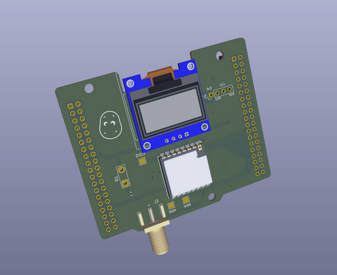
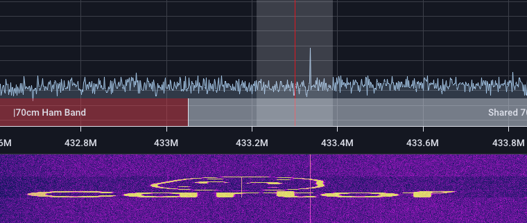

This repo contains all the code mentioned in the documentation.


It contains four components:
1. The Chirpstack Network server in `chirpstack`
2. HackRF LoRa 1 channel gateway in `gateway`
3. A PID algorithm implementation in `pid_controller`
4. The code for a node in `node`

## Hardware
This project is supposed to work with the following hardware:
1. A HackRF One as a LoRa concentrator / gateway
2. An STM32F104xxx microcontroller as a node
3. Some sensors / actuators connected to the microcontroller (extending the `Sensor` class in `node/include/sensors/sensor.h`)
4. A computer capable of running Docker containers to host the Chirpstack server, the gateway software and the PID controller.



## Running
First, we need to spin up the concentrator + chirpstack server + pid controller. This can be done using `compose.yml` file in root:

```bash
docker compose up --build
```
This will run everything. Make sure to edit the .env file to set the correct values.

If you're running an SDR to monitor the LoRa traffic, you should see this:


Next, we flash the node firmware to the microcontroller. This can be done using PlatformIO.

```bash
cd node
pio run -t upload
```

Make sure to set the correct LoRa parameters in `node/include/lora/config.h` before flashing!

After that, the system should be up and running!
